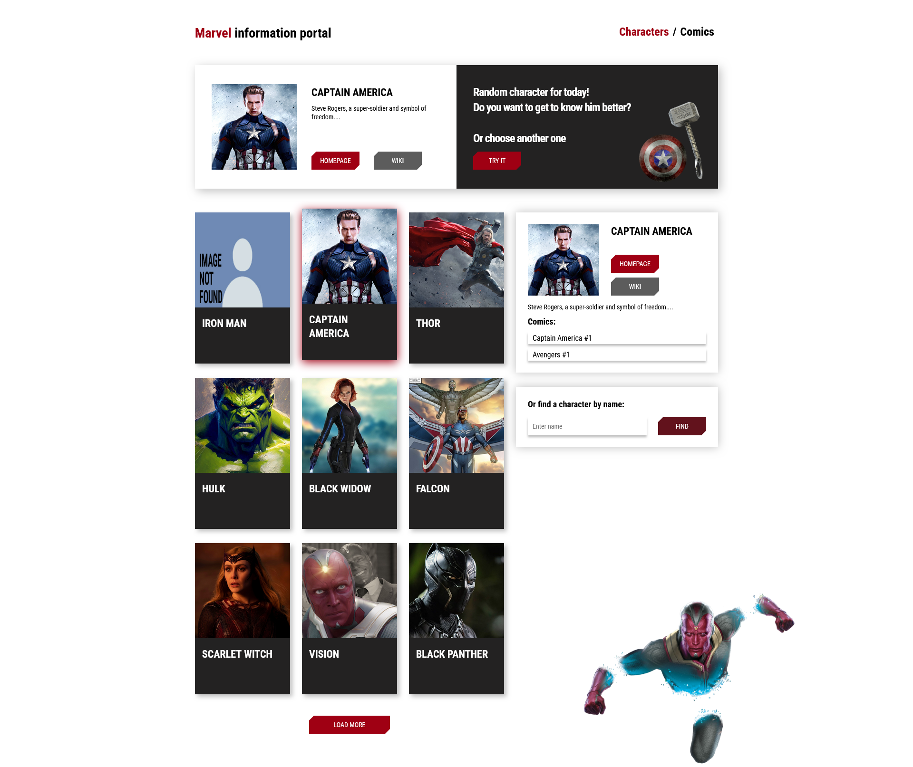
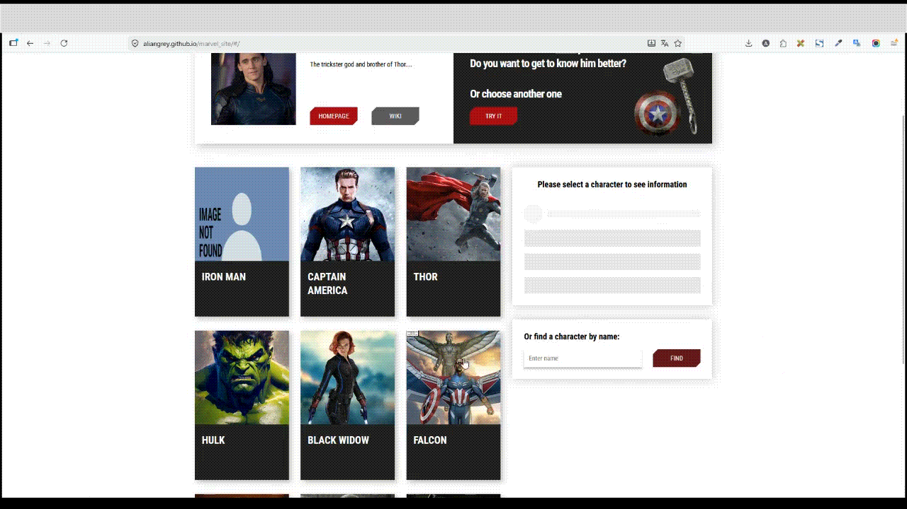
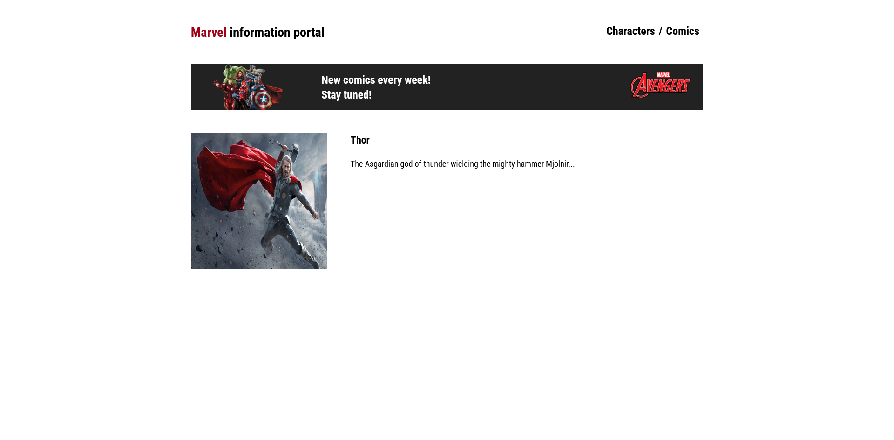
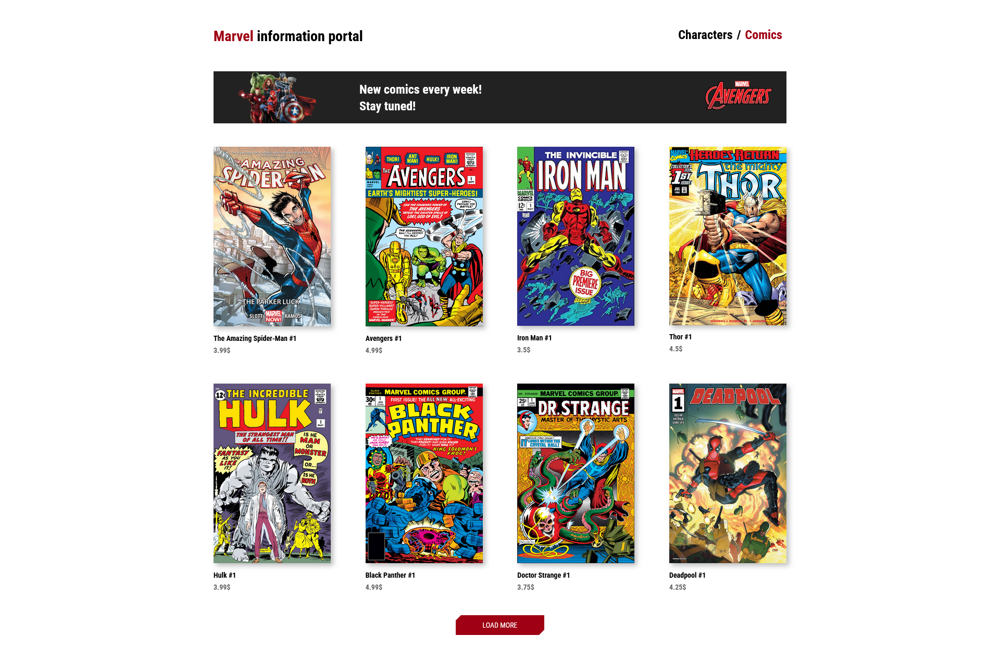
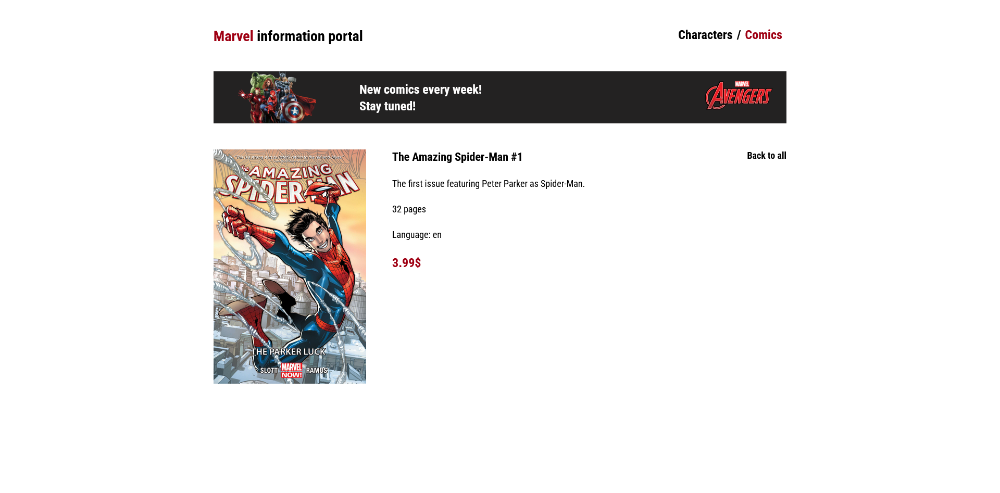

# 🦸 Marvel Information Portal

## 📌 Overview
A full-featured React SPA that allows users to explore Marvel characters and comics using real API data.

The application includes dynamic routing, advanced UI interactions, search functionality, lazy loading and robust state handling.

---

## 🚀 Live Demo

👉 [View Live Demo](https://aliangrey.github.io/marvel_site/)

---

## 📸 Screenshots

<p align="center">
  
  
</p>

<p align="center">
  
  
</p>

<p align="center">
  
  
</p>

---

## ✨ Features

### 🦸 Characters
- Browse list of Marvel characters  
- View detailed character information  
- Display comics related to each character (limited to 10)  

### 🎲 Random Character
- Random character generator  
- Manual switching via button  
- Automatic rotation using `setInterval`  
- External links (homepage, wiki)  

### 🔍 Search
- Search character by name  
- Validation (required, min length)  
- Disabled button state  
- Success message with navigation link  

### 📚 Comics
- Browse comics list  
- View individual comic pages  
- Load more comics dynamically  

### ⚡ UI / UX
- Keyboard navigation support  
- Focus and active state highlighting  
- Smooth animations (CSS transitions)  
- Lazy loading with `React.lazy` + `Suspense`  
- Skeleton placeholder before selection  
- Spinner during loading  
- Error handling UI  

### 🔄 Data Loading
- Load more functionality for characters and comics  
- Button disappears when data ends  

---

## 🛠 Tech Stack

- React  
- React Router DOM  
- JavaScript (ES6+)  
- CSS / CSS Transitions  
- Formik + Yup  
- PropTypes  

---

## ⚛️ React & Advanced Concepts

- useState  
- useEffect  
- useRef  
- useMemo  
- Lazy loading (`React.lazy`, `Suspense`)  
- Custom hooks  
- Error Boundaries  
- Controlled forms  

---

## 🌐 API Integration

- Data fetched from external Marvel API  
- Custom service layer (`MarvelService`)  
- Reusable HTTP hook (`useHttp`)  

---

## 🧭 Routing

```text
/
/comics
/characters/:id
/comics/:id
```
📂 Project Structure
```text
src/
  components/
    appHeader/
    charList/
    charInfo/
    charSearchForm/
    randomChar/
    comicsList/
    skeleton/
    spinner/
    errorMessage/
    errorBoundary/
    pages/
      singleCharacterLayout/
      singleComicsLayout/

  hooks/
    http.hook.js

  services/
    MarvelService.js

  utils/
    setContent.js

  style/
  resources/

  index.js
```
---

## 🎯 Key Functionality

📌 Character List
Click or keyboard navigation
Highlight active item
Smooth transitions

📌 Character Info
Detailed data view
External links
Comics list

📌 Search Form
Formik + Yup validation
Dynamic UI feedback

📌 Loading States
Spinner during requests
Skeleton for empty state
Error fallback UI

---

## 🎯 Purpose

This project was created to practice:

building complex SPA applications
working with real APIs
advanced React patterns
performance optimization
scalable architecture

---

## 📌 Notes

This project represents a complete frontend application with real-world features, including routing, API interaction, form validation and performance optimizations.

---

## 📬 Contact
- GitHub: [AlianGrey](https://github.com/AlianGrey)
- LinkedIn: [LinkedIn Profile](https://www.linkedin.com/in/kostrikinaelena/)
- Email: ek371117@gmail.com